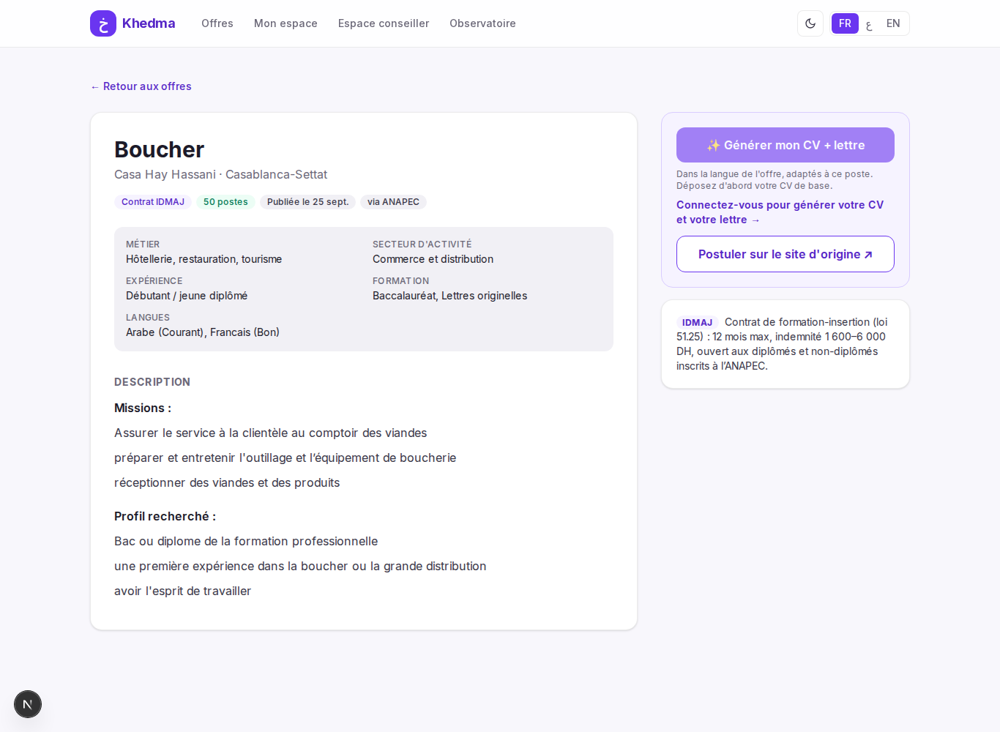
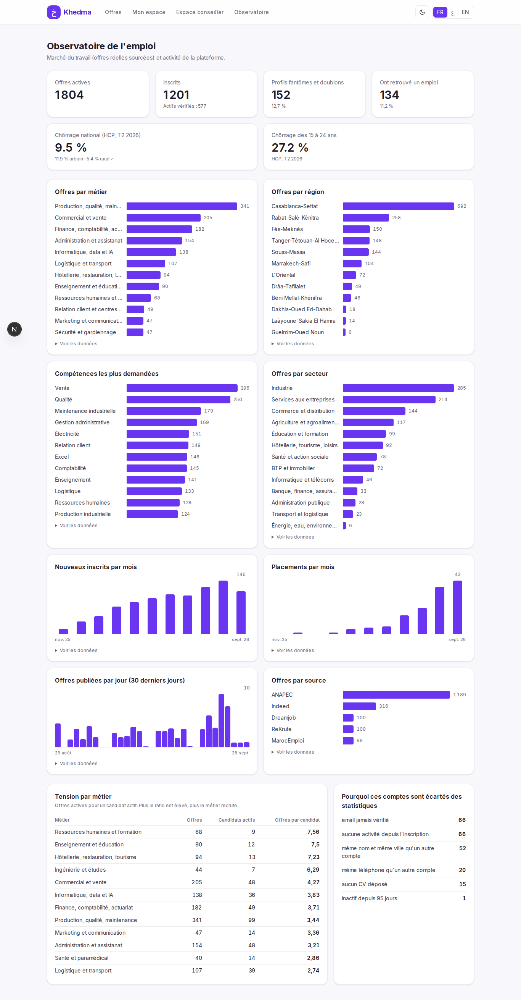

# Khedma

Un chercheur d'emploi au Maroc consulte aujourd'hui cinq ou six sites pour couvrir le marché : l'ANAPEC pour les contrats d'insertion, ReKrute pour les postes de cadres, Indeed, MarocEmploi, Dreamjob pour les concours. Chaque site a ses propres catégories, et il faut réécrire son CV et sa lettre à chaque candidature.

Khedma regroupe ces offres au même endroit, les classe selon le profil du candidat et prépare pour chaque offre un CV et une lettre dans la langue de l'annonce. Le candidat postule ensuite sur le site d'origine avec ses deux fichiers.

Le projet a été construit comme démonstrateur pour le service public de l'emploi : un espace conseiller et un observatoire du marché complètent la partie candidat.



## Ce que fait la plateforme

**Pour le candidat**
- recherche dans toutes les sources avec des filtres communs : métier, secteur, expérience, région, contrat, date ;
- dépôt d'un CV de base (PDF, DOCX ou texte), transformé en profil structuré ;
- offres recommandées avec un score et son explication (compétences couvertes, compétences manquantes) ;
- un bouton par offre pour générer un CV d'une page, lisible par les logiciels de tri des recruteurs, et une lettre de motivation, dans la langue de l'offre ;
- compétences les plus souvent manquantes dans ses offres, avec un lien vers les formations gratuites de l'ANAPEC ou de l'OFPPT ;
- éligibilité indicative aux dispositifs publics : contrat de formation-insertion (loi 51.25), TAHFIZ, TADAROJ ;
- interface en français, arabe (de droite à gauche) et anglais, mode sombre.

**Pour le conseiller**
- portefeuille de candidats trié par priorité : comptes dormants, candidats sans candidature, inactivité ;
- suggestions d'offres pour chaque candidat, calculées par le moteur de matching.

**Pour le pilotage (observatoire)**
- offres par métier, région, secteur et source, compétences les plus demandées ;
- tension par métier (offres actives par candidat actif) ;
- inscrits, actifs vérifiés, placements, et comptes écartés des statistiques avec leur motif (profils fantômes, doublons).

## Choix techniques

| Besoin | Choix | Pourquoi |
|---|---|---|
| Stockage et recherche | PostgreSQL 17 + pgvector (index HNSW) | recherche vectorielle et SQL classique dans la même base |
| Représentation des offres et des profils | modèle multilingue `paraphrase-multilingual-MiniLM-L12-v2` exécuté localement (ONNX) | aucun appel d'API par offre ; un profil en arabe retrouve une offre en français |
| Matching | rappel des 300 offres les plus proches, puis score pondéré (sens, compétences, région, contrat, fraîcheur, niveau d'études) | rapide sur de gros volumes, et chaque score s'explique |
| Rédaction et traduction | Gemini 3.8 Flash sur Vertex AI (région UE) | appelé uniquement au clic, avec un résumé compact du profil, résultat mis en cache |
| Rendu des PDF | Chromium (Playwright) | contrôle exact de la mise en page et de l'arabe |
| API | FastAPI | |
| Interface | Next.js 16, Tailwind CSS | |

Le modèle de langue ne sert qu'à ce qui demande vraiment de la rédaction : l'accroche du CV, la lettre et les traductions. La sélection et l'ordre des expériences, la mise en page du CV et la traduction des catégories (métiers, secteurs, régions, contrats) se font sans lui. Mesuré sur une candidature réelle : environ 580 tokens en entrée et 120 en sortie pour le CV, 460 et 200 pour la lettre. Une deuxième génération pour la même offre sort du cache.

## Données

Les offres sont réelles et renvoient toujours vers l'annonce d'origine. Les sources respectent leur `robots.txt` et sont interrogées à un rythme limité. LinkedIn et MarocAnnonces en sont exclus : leur `robots.txt` l'interdit. Indeed est interrogé via Firecrawl ; ses conditions d'utilisation limitent la collecte automatique, son usage se limite donc à cette démonstration.

Les comptes candidats et conseillers, les candidatures et les placements sont des données de démonstration, générées par `scripts/seed_demo.py` et marquées `is_demo` en base. Les taux de chômage affichés sont ceux du HCP (enquête emploi, T2 2026).

## Lancer le projet en local

Prérequis : Docker, Python 3.12, Node.js 20 ou plus.

```bash
docker compose up -d db
python3 -m venv .venv
.venv/bin/pip install -r backend/requirements.txt
.venv/bin/playwright install chromium
cp .env.example .env

cd backend
../.venv/bin/python -m scripts.ingest anapec --pages 80
../.venv/bin/python -m scripts.ingest rekrute --pages 10
../.venv/bin/python -m scripts.embed_offers
../.venv/bin/python -m scripts.seed_demo
../.venv/bin/uvicorn app.main:app --port 8010 --reload

cd ../frontend
npm install
npx next dev -p 3010
```

Sans identifiants Google Cloud, la plateforme fonctionne en mode simulé : le CV et la lettre sont produits à partir de modèles de phrases, et les offres restent dans leur langue d'origine.

Pour activer Gemini, déposer le fichier JSON du compte de service dans `secrets/` (dossier ignoré par git), puis renseigner dans `.env` `LLM_PROVIDER=gemini` et `GOOGLE_APPLICATION_CREDENTIALS=secrets/<fichier>.json`. Le compte de service a besoin du rôle Vertex AI User. En hébergement, le contenu du JSON se passe dans la variable secrète `GCP_SERVICE_ACCOUNT_JSON`.

Comptes de démonstration, mot de passe `demo12345` :
- candidat : `yassine.demo@example.com`
- conseiller (Casablanca-Settat) : `conseiller6@demo.khedma.ma`
- administration : `admin@demo.khedma.ma`

## Organisation du code

```
backend/app/sourcing/   connecteurs par source, normalisation, taxonomies métier et secteur
backend/app/matching/   embeddings, moteur de matching, compétences, éligibilité, profils fantômes
backend/app/ai/         lecture du CV, fournisseurs de LLM, génération du CV et de la lettre, traduction
backend/app/api/        routes : offres, compte candidat, conseiller et observatoire
backend/scripts/        ingestion, vectorisation, recalcul, données de démonstration
frontend/src/           pages Next.js, composants, dictionnaires FR / AR / EN
```

## Limites connues

- La collecte se lance à la main ; en production, elle tournerait sur un planificateur, avec détection des offres expirées.
- La lecture des CV scannés (images) n'est pas gérée.
- L'éligibilité aux dispositifs publics est indicative et doit être confirmée par un conseiller.


